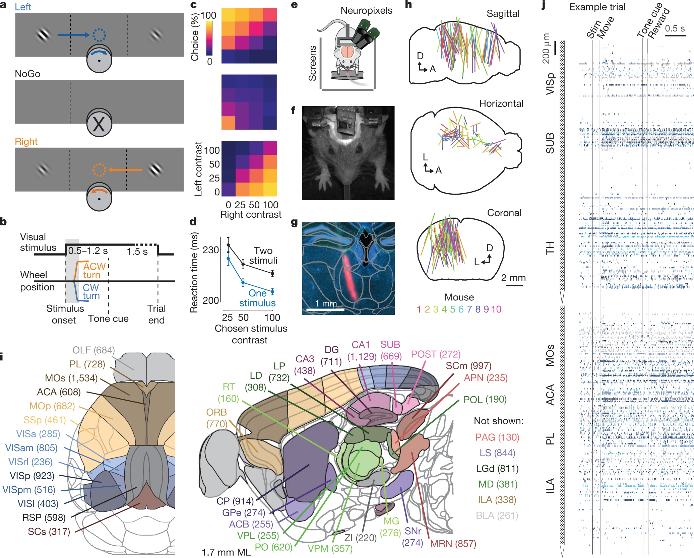
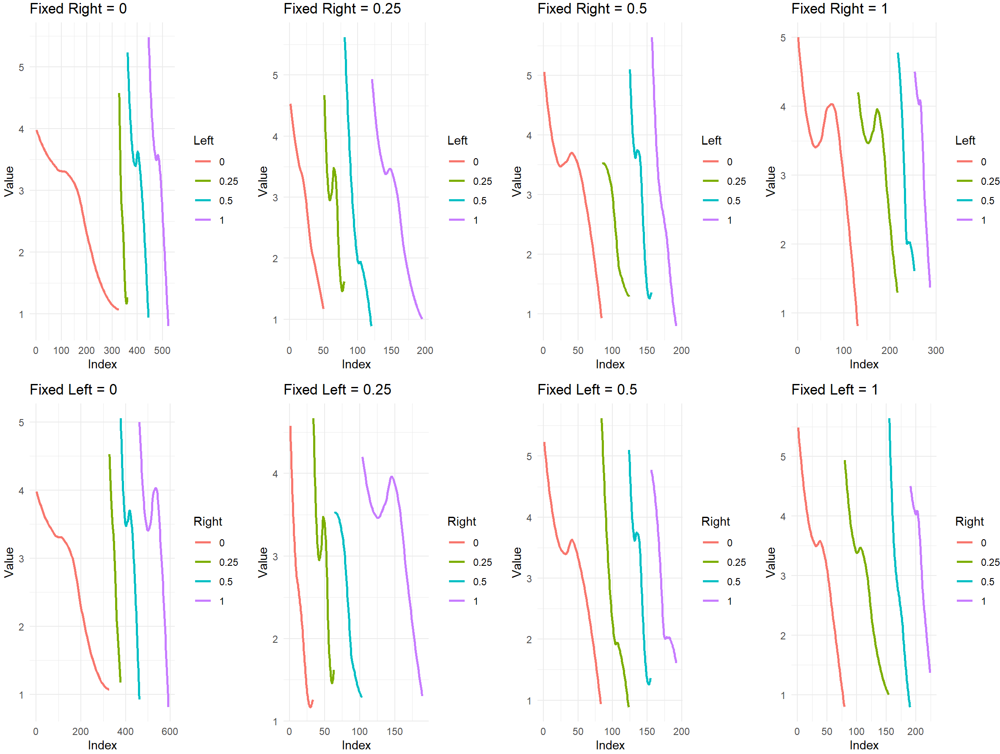
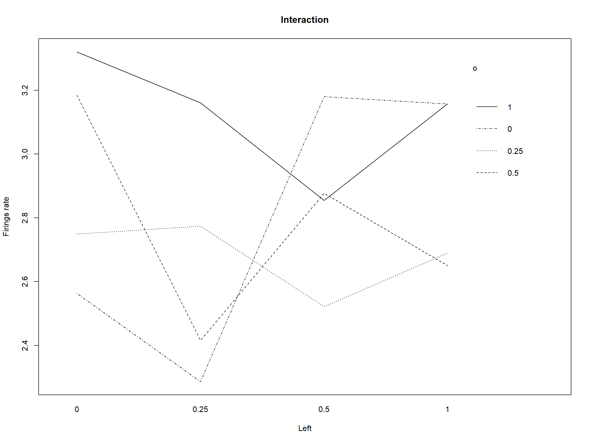
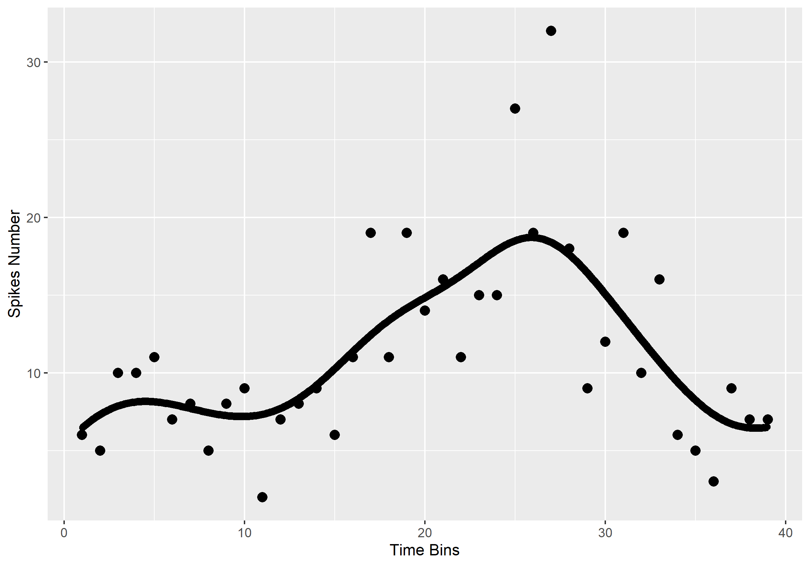
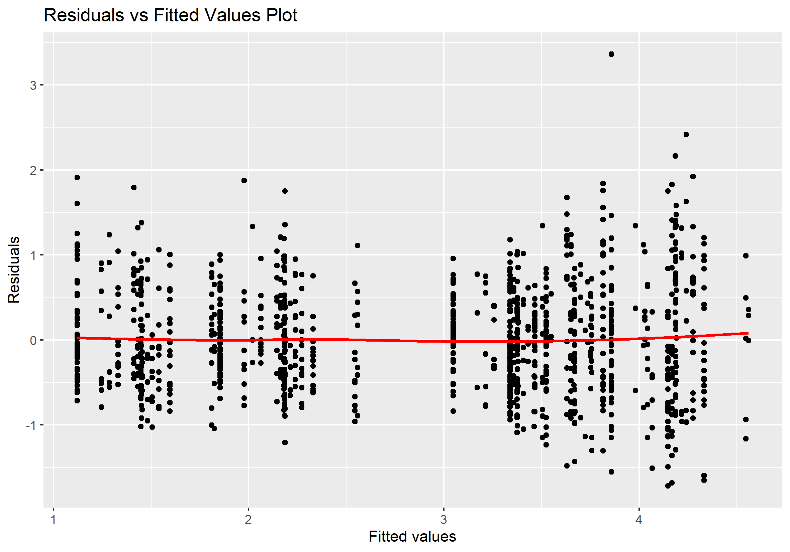
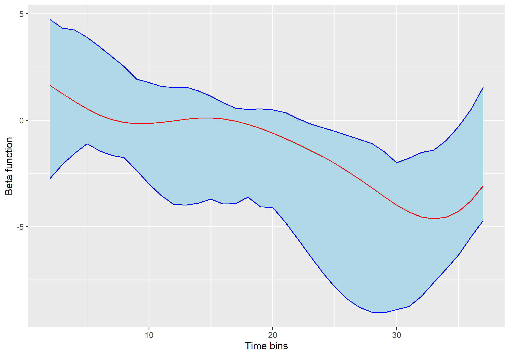
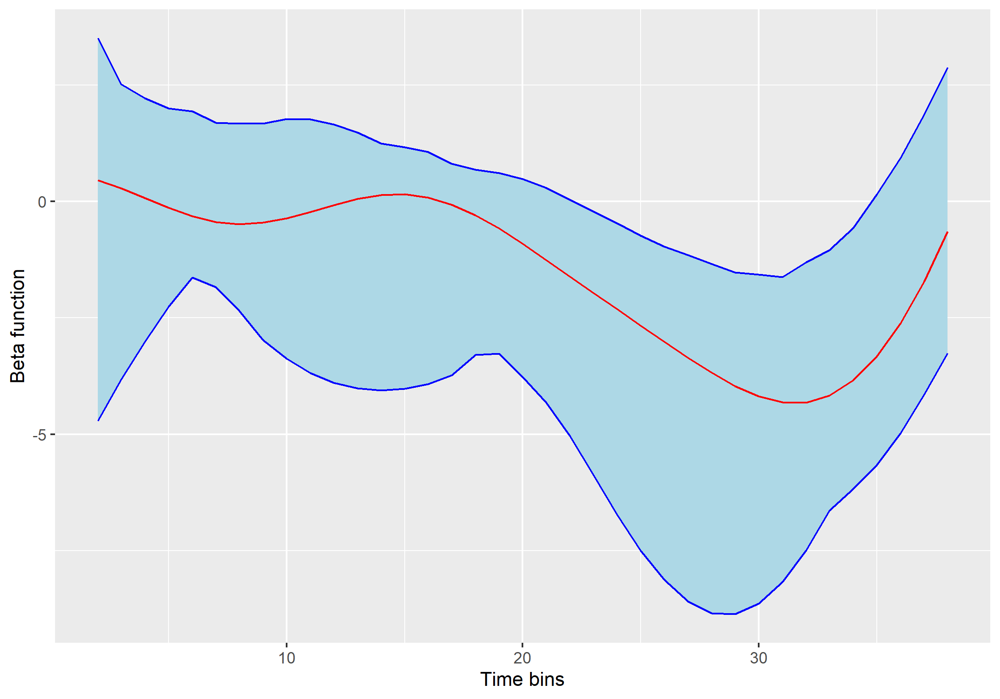
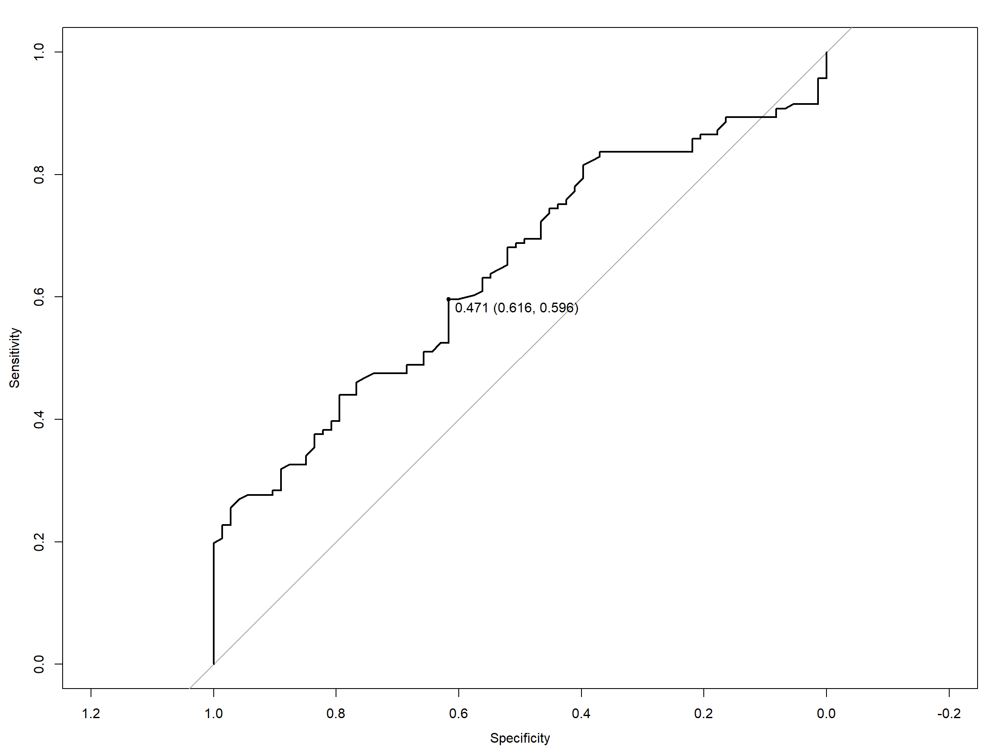

```{r include=FALSE}
library(car)
library(lme4)
library(lmerTest)
library(haven)
library(dplyr)
library(qwraps2)
library(ggplot2)
library(tidyr)
library(ggpubr)
library(plotly)
library(car)
library(stats)
library(mice)
library(VIM)
library(lattice)
library(tidyverse)
library(readxl)
library(tidyr)
library(fdapace)
library(dplyr)
library(lubridate)
library(fdaconcur)
library(ggplot2)
library(locpol)
library(KernSmooth)
library(ggpubr)
library(tidyr)
library(reshape2)
library(magrittr)
library(plot3D)
library(MASS)
library(boot)
library(foreach)
library(doParallel)
library(parallel)
options(qwraps2_markup = "markdown", digits=2)
```
# Abstract

Based on the dataset from Steinmetz et al. in 2019, this project uses a two way analysis of variance model with random intercept and functional concurrent regression model to prove the the stimuli on eyes have effect on the firing rates of neurons and their combination effects are also significant on the firing rates of neurons. Meanwhile, this project provides a prediction method to predict the action of mice according to the stimuli and neural activities, whose specifity and sensitivity are around 0.6.

# Introduction

According to Steinmetz et al. (2019), performing a perceptual decision involves processing sensory information, selecting actions that may lead to reward, and executing these
actions. Understanding the decision process is important for the development of computer science, neurological science, economics and other areas.

In computer science, understanding how animals make decisions can inform us about how to design better decision-making algorithms for artificial intelligence (Kiani & Shadlen, 2009). Also, a lot of diseases are caused by neurons disorder so studying the neuronal circuits underlying decision-making can provide insights into the underlying mechanisms of neurological disorders such as schizophrenia, autism, and addiction (Meyer-Lindenberg, 2010). Moreover, in the economics field, understanding the decision-making process of consumers will not only improve market research, but also improve product design (Glimcher, 2011).

To have a deeper understanding of the decision-making processes of animals and how the neurons involved in these processes act across brain regions. I use the data from Steinmetz et al. in 2019 to answer two questions, the first one is how do neurons in the visual cortex respond to the stimuli on the left eye and right eye, the second one is to find a method predicting the outcome or decision of the animal given the activities of neurons and the stimuli. The result of this project will show how mice act to the stimuli on their two eyes and an appropriate prediction method.

# Background

This project uses the data provided by Steinmetz et al. and the experiment was conducted in 2019. They used Neuropixels probes to record from approximately 30,000 neurons in 42 brain regions and there are totally 39 sessions using 10 mice. The data recorded are consisted by each session, including the name of the mouse, the date of the session and the detailed data in each session. In each session, there are several trials. The stimuli on the two eyes of the mouse is recorded and the actions of neurons from 0 to 0.4 second after stimulus onset are also recorded.

In this report, I only use 5 sessions of data from two mice: Cori and Forssman. The following graph is also from Steinmetz et al. which describes the experiment clearly and several important graphs will be introduced in this report.
{width=85%, align=center}

**a**, mice earned water rewards by turning a wheel to indicate which of two visual gratings had higher contrast, or by not turning if no stimulus was presented. When stimuli had equal contrast, mice will be rewarded if turning the wheel with 50% probability. **h**, each colored line represents the span recorded by a single probe on a single session, colored by mouse identity. **i**, this is the summary of recording locations, recordings were made in the 42 brain regions and the number indicates total recorded neurons. **j**, spike raster from an example individual trial, in which populations of neurons were simultaneously recorded across visual and frontal cortical areas, hippocampus and thalamus and in this project, the mean firing rate (MFR) is the important indicator for the action after stimuli which is calculated as MFR=Total number of fired neurons/Total number of neurons monitored as the overall effect of each trials can be described in this value. 

This dataset is a well-organized dataset based on an accurate experiment and no missing values exist. However, whether the different sessions using the same mouse can be regarded as different mouse is discussed in the following section and as the analysis window is set as 0 to 0.4 second then a functional concurrent regression could be used to explore the information rather than simply using a mean to represent the neural activities.

# Descriptive analysis

The descriptive analysis includes the structure of the data, the summary table including the quantiles and means combining the five sessions and the interaction plots. Meanwhile, I show the difference in plots for different contrasts group (Left=1, Right=1) is one group. These plots provide insights to the data and guide the following research in this project.

|                                 |Trials (N = 1,196)        |
|:--------------------------------|:-------------------------|
|**Firing rate**                  |&nbsp;&nbsp;              |
|&nbsp;&nbsp; min                 |0.40                      |
|&nbsp;&nbsp; median              |2.96                      |
|&nbsp;&nbsp; max                 |7.22                      |
|&nbsp;&nbsp; lower quatile       |1.92                      |
|&nbsp;&nbsp; upper quantile      |3.69                      |
|&nbsp;&nbsp; NA values' number   |0                         |
|**Left contrast**                |&nbsp;&nbsp;              |
|&nbsp;&nbsp; Left Contrast=1     |224                       |
|&nbsp;&nbsp; Left Contrast=0.5   |192                       |
|&nbsp;&nbsp; Left Contrast=0.25  |189                       |
|&nbsp;&nbsp; Left Contrast=0     |591                       |
|&nbsp;&nbsp; NA values' number   |0                         |
|**Right Constrast**              |&nbsp;&nbsp;              |
|&nbsp;&nbsp; Right Contrast      |287                       |
|&nbsp;&nbsp; Right Contrast=0.5  |192                       |
|&nbsp;&nbsp; Right Contrast=0.25 |195                       |
|&nbsp;&nbsp; Right Contrast=0    |522                       |
|&nbsp;&nbsp; NA values' number   |0                         |

The first summary table is for the count number of each combination, it's an unbalanced dataset and in the next plot, the Firing rate for each combination is shown. In the following graph, the fixed contrast is shown on the titles and the different contrasts in another factor are shown by theirs index in smoothed curves with LOESS method. From this plot, it can be seen that firings rate will be higher if both contrast are high approximately. Meanwhile, the mean of different combinations are different.
{width=85%,align=center}
{width=46%}{width=46%}

The interaction plot is used to find if there is interaction term between the two factors. Besides, in the following step, the functional properties will be taken into consideration and smoothing method is needed to show the curves for trials. Hence, I show one plot as an example, this plot show the number of spikes in continuous time bins with local linear type and Epanechnikov kernel with a bandwidth selected by the rule of thumb with no obvious overfittedness.

# Inferential analysis

From the interaction plot and the design of the experiment, an interaction term needs to be included and as the sessions are randomly selected from the whole dataset, a random intercept for each session is needed as well. Hence, there are two factors and the two way analysis of variance (ANOVA) model with intercept and interaction is as follow.
$$Y_{ijk(\nu)}=\mu_{(\nu)}+\alpha_i+\beta_j+(\alpha\beta)_{ij}+\epsilon_{ijk} \ \ \ (i=1,...,4;j=1,...,4;k=1,..,N;\nu=1,...,5)$$
where $N$ is the total number of samples and $\alpha_i$ is the fixed factor brought by left contrast, $\beta_j$ is the fixed factor brought by right contrast, $\mu_{(\nu)} \sim N(\mu_{\nu}, \tau_{\nu}^2)$ and $\epsilon_{ijk} \sim N(0,\sigma^2)$. Both the random parts in this model follow normal distribution, the $\mu_{\nu}$ follows a normal distribution with mean equal to $\mu_{\nu}$ and variance: $\tau_{\nu}^2$.

To test the existence of interaction, I use TYPE-THREE sums of squares in ANOVA with Satterthwaite's method to find the effective degrees of freedom, the following table is the model with random intercept.

|           | Sum Sq| Mean Sq| NumDF| DenDF| F value| Pr(>F)|
|:----------|------:|-------:|-----:|-----:|-------:|------:|
|Left       |    8.5|    2.84|     3|  1176|     7.1|  0.000|
|Right      |   13.0|    4.34|     3|  1176|    10.9|  0.000|
|Left:Right |    7.0|    0.77|     9|  1176|     1.9|  0.044|

According to the table in this section, through computing the sums of squares of factor A or B given B or A and interaction term, the sums of squares of of interaction term given factor A and B and using the F-test, the p-values are calculated. All of them are smaller than 0.05, which means I have 95% confidence level that the interaction term exist. And more specifically, the contrast on visual cortex on the left eye and right eye has a combined effect rather than only affecting the visual cortex separately. To make this conclusion sounder, several steps are needed in the following parts.


# Sensitivity analysis

This section is consisted of the method to find the existence of random intercept, residual plots for the ANOVA model to find if the error terms follow a normal distribution and a functional concurrent regression model with bootstrap to decide the existence of interaction terms based on functional properties in each 0.4 second time bin.

## Existence of random intercept

To find if the random intercept is needed in this model, a model without random intercept $$Y_{ijk}=+\alpha_i+\beta_j+(\alpha\beta)_{ij}+\epsilon_{ijk} \ \ \ (i=1,...,4;j=1,...,4;k=1,..,N)$$ with the same notations as the random intercept model mentioned. From the paper by Douglas M. Bates published in 2014, he used a model without random intercept and a model with random intercept using the same maximum likelihood estimation rather than restricted maximum likelihood, then he compared the two models using AIC criteria to test the existence of random intercept so in this project, I also use AIC criteria to compare the two models.

|       | npar|  AIC|  BIC| logLik| deviance| Chisq| Df| Pr(>Chisq)|
|:------|----:|----:|----:|------:|--------:|-----:|--:|----------:|
|model2 |   17| 3788| 3874|  -1877|     3754|    NA| NA|         NA|
|model1 |   18| 2350| 2441|  -1157|     2314|  1440|  1|          0|

Model 1 is with the random intercept and model 2 is without the random intercept, from the AIC, it's obvious that model 1 has the lower AIC value which means the existence of random intercept. 

## Residuals analysis

The validity and power of the model inference are largely based on whether the model assumptions are met. Here I mainly check two assumptions, the first one is the homogeneity of variances. I plot the residuals v.s. fitted value plot below and the degree of scattering of points are almost constant so the model assumptions are met, the red smoothing line in the middle part of this plot is from the local mean of residuals using ‘LOESS’ method. The normality of residuals is also met through visually checking the quantile-quantile plot.

<center>{width=60%}</center>


## Functional concurrent regression for interaction terms

As the random intercept's existence has been proved in this dataset, to find the interaction terms' existence, a functional concurrent regression model can be used on each session of data and the results from each session are combined in this section to get a conclusion about the existence of interaction term.

First of all, the model of functional concurrent regression is $$Y(t) = \beta_0(t)+\sum_{i=1}^{15}\beta_i(t)C_i+\epsilon(t)$$ $t \in T$, where $\beta_i(t)$s are coefficient functions, $Y(t)$ is the spikes number function and $\epsilon(t)$ is a random process with finite variance and zero mean and $C_i$ is an indicator function for the existence of factors and interactions (Wang, 2016). For example, there are 4 contrasts on the left so there should be 3 predictors in the regression model and so there will be 15 predictors in the model including the interaction terms.

I use the first data set as example to show the research process, all of the recorded spikes have the same time intervals which is necessary for the computation of functional concurrent regression. The computation is based on the **fdaconcur** package by Wang et al. and **parallel** package for computation by Tierney et al. in R.

In the following plots, I show two coefficient functions $\beta_8(t)$ and $\beta_9(t)$ which are the coefficient functions of interactions (Left=0.25, Right=0.5) and (Left=0.25, Right=0.5).

{width=47%} {width=47%}

From the two plots above, the blue shades are the confidence intervals at 95% confidence level calculated by bootstrap and the repeated times are 100. After calculating all the plots for each session, it's clear that the interaction are significant at 95% confidence level so the interaction terms should be included in functional view and they play important roles in the last several time bins.

# Predictive modeling

In the predictive modeling part, I use the machine learning method for a better prediction result. The method I choose is random forest, I use the first session data as test set and the next four data sets as training sets. As the randomness of the five sessions has been proved in the sensitivity analysis section, it's appropriate and easier to use the first session rather than randomly sampling test data set from the whole five sessions.

According to wiki, random forests is an ensemble learning method for classification, regression and other tasks that operates by constructing a multitude of decision trees at training time. The calculation is based on function in package **randomForest**.

The predictors selected for random forest are based on the characteristics of the curve in each trial. A possible selection of predictors are the maximum, mean and variance of the sample. However, based on the discovery in functional concurrent regression for interaction terms, the spikes in the last several time bins are mainly affected by the interaction whose activities may include the impacts from the two stimuli hence the maximum, mean and variance of the last half data are also the predictors.

|   | F|  T|
|:--|--:|--:|
|**F** | 39| 50|
|**T**  | 34| 91|

F means false action and T means right action. The confusion matrix shows a accuracy at about 0.6 and the FP=0.35 and FN=0.27. The trees in the random forest are 1000. I also show the receiver operating characteristic curve (ROC) and in the plot, both the specificity and sensitivity are around 0.6.
<center>{width=70%} </center>


# Discussion

The answer to the first question is that not only the two stimuli will affect the neuron activities separately, but the combination of the two stimuli will also affect the neuron activities and the interactions mainly appear at the end of monitored time period. The prediction based on functional properties of the curves have a medium accuracy level at around 0.6.

Though the appearance of random intercept is proved in this project, it has to be mentioned that this is not the best way to find the existence of random intercept. As mentioned by Douglas M. Bates in 2014, such method is checking for something that is on the boundaries of the parameter space so actually it's not technically sound which means a better method could be used in finding the existence of random intercept.

This project also has a lack of prediction accuracy, a 0.6 specificity and sensitivity may be improved by the use of neural network or other machine learning methods. Meanwhile, more functional properties could be selected such as functional model with scalar response, which may fit this model.


# Acknowledgement

I would like to thank Dr.Chen's teaching in this semester and the helps from Jing and Qian. Thank you!


# Reference {-}

Steinmetz, N.A., Zatka-Haas, P., Carandini, M. et al. Distributed coding of choice, action and engagement across the mouse brain. Nature 576, 266–273 (2019). https://doi.org/10.1038/s41586-019-1787-x

Kable, J. W., & Glimcher, P. W. (2009). The neurobiology of decision: consensus and controversy. Neuron, 63(6), 733-745.

Meyer-Lindenberg, A. (2010). From maps to mechanisms through neuroimaging of schizophrenia. Nature, 468(7321), 194-202.

Glimcher, P. W. (2011). Understanding dopamine and reinforcement learning: the dopamine reward prediction error hypothesis. Proceedings of the National Academy of Sciences, 108(Supplement 3), 15647-15654.

Jun, J. J. et al. Fully integrated silicon probes for high-density recording of neural activity. Nature 551, 232–236 (2017).

Steinmetz, N. A., Koch, C., Harris, K. D., & Carandini, M. (2018). Challenges and opportunities for large-scale electrophysiology with Neuropixels probes. Current opinion in neurobiology, 50, 92-100.

Bates, D., Mächler, M., Bolker, B., & Walker, S. (2014). Fitting linear mixed-effects models using lme4. arXiv preprint arXiv:1406.5823.

http://stat.ethz.ch/R-manual/R-devel/library/parallel/doc/parallel.pdf

https://cran.r-project.org/web/packages/fdaconcur/index.html

Wang, J. L., Chiou, J. M., & Müller, H. G. (2016). Functional data analysis. Annual Review of Statistics and its application, 3, 257-295.

https://en.wikipedia.org/wiki/Random_forest

https://cran.r-project.org/web/packages/randomForest/index.html
